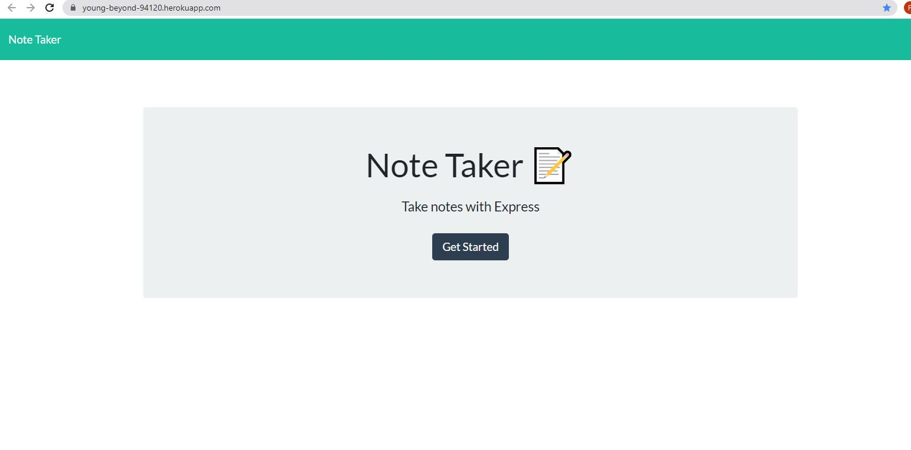
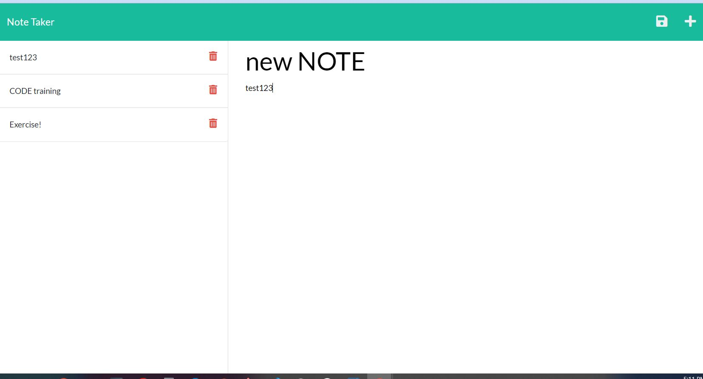

# Note Taker -Unit 11

## Description

This app will allow a user to view, create and delete daily tasks. 

## Acceptance Criteria

* WHEN I open the Note Taker
THEN I am presented with a landing page with a link to a notes page

 * WHEN I click on the link to the notes page
    * THEN I am presented with a page with existing notes listed in the left-hand column, plus empty fields to enter a new note title and the note’s text in the right-hand column

 * WHEN I click on the Write icon in the navigation at the top of the page
    * THEN I am presented with empty fields to enter a new note title and the note’s text in the right-hand column

* WHEN I enter a new note title and the note’s text
  * THEN a Save icon appears in the navigation at the top of the page

* WHEN I click on the Save icon
  * THEN the new note I have entered is saved and appears in the left-hand column with the other existing notes

* WHEN I click on an existing note in the list in the left-hand column
   * THEN that note appears in the right-hand column
* BONUS - WHEN I click on the delete (trashcan) icon
  * THEN that note is deleted from the note list

 

## Deployed Website

[Note-Tracker](https://young-beyond-94120.herokuapp.com/) * MIT License

 

## Technologies Used

* 

* 

* 

* 

* `Deployed with Heroku` 

  * 
 
 

 ## Example screen shots:
 

 

## My Contact info
- Ron Shutter | [ Github Profile](https://github.com/Proton-8) | <a href="mailto:ronashutter@gmail.com"> email</a> |<a href="https://www.linkedin.com/in/ron-shutter-95613211/"> LinkedIn</a> 
    

